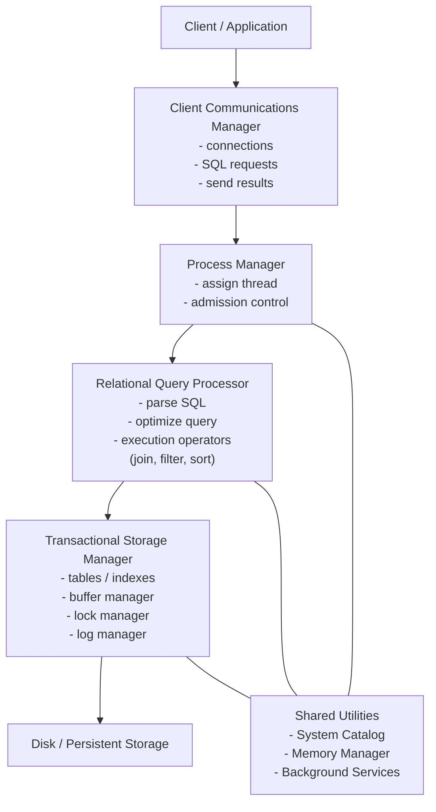
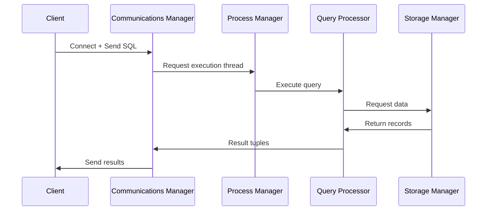

# Study Notes - Architecture of a Database System (Introduction & Life of a Query)

---

# 1. Topic Overview

Database Management Systems (DBMSs) are **complex, mission-critical software systems** that form the backbone of modern digital infrastructure. They manage vast amounts of data for applications such as e-commerce, banking, healthcare, and social platforms.

Modern DBMSs embody **decades of research and engineering** and have influenced the design of many other types of software systems including:

* operating systems
* networked services
* large-scale applications

This section introduces:

* the **architectural structure of a DBMS**
* the **major components inside a database system**
* the **life cycle of a query** (how a database processes a request)

Understanding this architecture provides insight into **how databases execute queries, manage data, ensure reliability, and support concurrent users**.

---

# 2. Core Concepts

## 2.1 Importance of Database Systems

Database systems are among the **most influential software systems in computer science**.

### Reasons for their importance

* They were **among the earliest online server systems**
* Many design solutions in distributed systems originated in DBMSs
* Their concepts are reused across software engineering fields

Examples of applications relying on DBMS:

* e-commerce systems
* medical records systems
* billing and payroll
* customer relationship management
* supply chain systems
* blogs, wikis, and social networks

These systems act as **repositories of record**, meaning they store the **authoritative version of critical data**.

---


# 3. Relational Database Systems (RDBMS)

## 3.1 Why the Paper Focuses on Relational Systems

The most mature and widely used database systems today are **Relational Database Management Systems (RDBMS)**.

Examples include systems used in:

* enterprise software
* web services
* online transaction systems
* content management systems

Relational systems are important because:

* they power most existing infrastructure
* they provide a well-understood model
* they serve as a reference point for future database innovations

---

## 3.2 Core Components of a DBMS

A typical relational DBMS contains **five main components**:

1. Client Communications Manager
2. Process Manager
3. Relational Query Processor
4. Transactional Storage Manager
5. Shared Utilities and System Components

These components cooperate to process queries and manage data.

Understanding them is easiest by examining **the life cycle of a query**.

---

# 4. Definitions

### DBMS (Database Management System)

Software that **stores, manages, retrieves, and manipulates data** in a structured and reliable manner.

---

### RDBMS (Relational DBMS)

A DBMS that stores data in **tables (relations)** and uses **SQL** for querying.

---

### SQL Query

A command written in SQL used to retrieve or modify data.

Example:

```
SELECT * FROM passengers WHERE flight_id = 101;
```

---

### Thread of Computation

A **unit of execution** assigned by the DBMS to process a query.

It represents the computational work performed to execute the query.

---

### Query Plan

An **internal execution strategy** generated by the database for processing a query.

It specifies:

* which operators to use
* how to access data
* how to combine results

---

### Operator

An algorithm used during query execution.

Examples:

* join
* selection
* projection
* aggregation
* sorting

---

### Transaction

A sequence of operations executed as a **single logical unit of work**.

Transactions guarantee the **ACID properties**.

---

### ACID Properties

Properties ensuring reliable transactions:

* **Atomicity** – all operations succeed or none do
* **Consistency** – database remains valid
* **Isolation** – concurrent transactions do not interfere
* **Durability** – committed changes persist after crashes

---

# 5. Detailed Explanation - The Life of a Query

To understand DBMS architecture, the paper walks through an example query.

### Example Scenario

An airport gate agent clicks a button to retrieve the **passenger list for a flight**.

This triggers a database query.

---

# 6. Step-by-Step Query Execution

## Step 1 — Client establishes connection

The client computer connects to the DBMS server.

This communication may happen in different architectures.

### Two-tier architecture (client-server)

```
Client → Database Server
```

Examples of connection protocols:

* ODBC
* JDBC

---

### Three-tier architecture

```
Client → Middleware Server → Database Server
```

Middleware may include:

* web servers
* transaction monitors

---

### Four-tier architecture (common in web systems)

```
Client
↓
Web Server
↓
Application Server
↓
Database Server
```

---

### Responsibilities of the Client Communications Manager

This component:

* establishes connections
* manages connection state
* receives SQL commands
* sends results or errors back to clients

Additional tasks:

* authenticate users
* maintain session information
* forward queries deeper into the DBMS

---

## Step 2 - Process Manager assigns computation

When the DBMS receives the SQL query:

1. It assigns a **thread of computation**
2. It connects the thread’s outputs to the communication manager

### Key responsibility: Admission Control

The DBMS decides whether:

* to execute the query immediately
* or delay it until system resources are available

This prevents system overload.

---

## Step 3 - Query Processor executes the query

The query is processed by the **Relational Query Processor**.

### Main tasks

1. Authorization check
2. SQL parsing
3. Query compilation
4. Query optimization
5. Execution plan creation

---

### Query Execution

The **plan executor** runs the query using operators such as:

* joins
* selections
* projections
* aggregations
* sorting

Operators also request data from lower system layers.

---

## Step 4 - Storage Manager retrieves data

The bottom layer of the system is the **Transactional Storage Manager**.

It handles:

* reading data
* writing data
* updating data
* deleting data

---

### Key components of the storage system

#### Access Methods

Data structures used to organize and retrieve data.

Examples:

* tables
* indexes

---

#### Buffer Manager

Moves data between:

* disk storage
* main memory buffers

This improves performance.

---

### Transaction Management

Before accessing data, the system must ensure **ACID guarantees**.

#### Lock Manager

* grants locks on data items
* prevents conflicts between concurrent queries

---

#### Log Manager

Used for recovery.

Ensures that:

* committed transactions are durable
* aborted transactions are undone

---

## Step 5 - Returning query results

Once data is retrieved, the system begins **unwinding the stack**.

### What is "unwinding the stack"?

It means **control flows back through the system layers**.

Execution path:

```
Storage Manager
↑
Query Executor
↑
Communication Manager
↑
Client
```

---

### Result generation

The query executor:

* processes retrieved data
* generates **result tuples**

These tuples represent rows returned to the user.

---

### Sending results to the client

Results are placed in a buffer and sent via the communication manager.

---

### Handling large result sets

If results are large:

* the client fetches results incrementally

Example:

```
Client requests first batch
DBMS sends rows
Client requests next batch
DBMS sends more rows
```

This involves multiple iterations through:

* communication manager
* query executor
* storage manager

---

### Cleaning up after the query

When the query completes:

**Transaction Manager**

* finalizes transaction
* releases locks
* clears transaction state

**Process Manager**

* releases thread resources
* removes query structures

**Communication Manager**

* closes connection
* clears communication state

---

# 7. Shared Components and Utilities

In addition to query execution modules, DBMS systems include shared utilities.

---

## Catalog (System Metadata)

The catalog stores metadata about the database.

Examples:

* table definitions
* index definitions
* schema information
* user privileges

It is used during:

* authentication
* parsing
* query optimization

---

## Memory Manager

Responsible for:

* allocating memory
* releasing memory
* managing memory usage across DBMS components

---

## Background Utilities

Some DBMS components run independently of queries.

Their role is to maintain system health and performance.

Examples include tasks that:

* optimize database structure
* maintain system reliability
* manage system resources

---


# 8. Common Confusions

### Communication Manager vs Process Manager

They have different responsibilities.

Communication Manager:

* handles network communication
* manages client sessions

Process Manager:

* assigns computation threads
* schedules query execution

---

### Query Plan vs Query Execution

Query Plan:

* a strategy describing how to execute a query

Query Execution:

* the actual running of that plan

---

### Storage Manager vs Query Processor

Query Processor:

* interprets SQL
* decides how to execute queries

Storage Manager:

* retrieves and modifies physical data

---

## DBMS Architecture


---

## Life of a Query


---