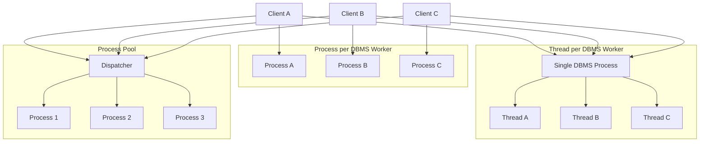

# Study Notes - DBMS Process Models, Threads, Shared Data & Admission Control

---

# 1. Topic Overview

This section explains how a DBMS handles **concurrent user requests** by mapping them to processes or threads. These decisions directly affect:

* performance
* scalability
* portability
* system complexity

It also covers:

* different process models
* shared data handling
* DBMS thread design
* real-world implementations
* admission control to prevent system collapse

This is foundational for understanding **how real database servers scale and remain stable under load**.

---

# 2. Core Concepts

## 2.1 Execution Units

* OS Processes
* OS Threads
* Lightweight Threads (LWT)
* DBMS Threads

---

## 2.2 DBMS Components

* DBMS Client
* DBMS Worker

---

## 2.3 Process Models

1. Process per DBMS Worker
2. Thread per DBMS Worker
3. Process Pool

---

## 2.4 Shared Data Structures

* Buffer Pool
* Log Tail
* Lock Table
* Communication Buffers

---

## 2.5 DBMS Threads

* Internal lightweight threads managed by DBMS

---

## 2.6 Standard Practice

* Real systems use combinations of models

---

## 2.7 Admission Control

* Prevents overload and thrashing

---

## 2.8 Future Architectures

* Task-based / engine-based designs

---

# 3. Definitions

### Operating System Process

A program execution unit with:

* its own private memory (address space)
* OS-managed resources
* scheduled by OS kernel

---

### Operating System Thread

A lightweight execution unit:

* shares memory within a process
* scheduled by OS
* also called kernel thread

---

### Lightweight Thread (LWT)

A thread managed by the application (user-space), not the OS.

* faster switching
* no kernel involvement
* requires non-blocking operations

---

### DBMS Thread

A lightweight thread implemented inside the DBMS.

* replaces OS threads
* scheduled by DBMS

---

### DBMS Client

Software (API/driver) used by applications to communicate with DBMS.

Examples:

* JDBC
* ODBC
* OLE/DB

---

### DBMS Worker

Execution unit inside DBMS that processes client requests.

* typically 1:1 with client
* executes SQL and returns results

---

# 4. Detailed Explanation

---

## 4.1 Process Models Overview

DBMS must decide:

```text
Client request → which execution unit?
```

This mapping defines system behavior.

---

## 4.2 Process per DBMS Worker

### What

Each client → separate OS process

### How

OS schedules processes

### Why

Simple and safe

### Pros

* strong isolation
* easy debugging
* OS handles scheduling

### Cons

* high memory usage
* expensive context switching
* requires shared memory for common data

---

## 4.3 Thread per DBMS Worker

### What

Each client → thread inside one process

### How

Dispatcher assigns threads

### Why

More scalable than processes

### Pros

* low memory overhead
* fast switching
* better scalability

### Cons

* shared memory bugs
* race conditions
* harder debugging

---

## 4.4 Process Pool

### What

Fixed/dynamic pool of processes reused for requests

### How

Requests assigned to available process

### Why

Reduce process overhead

### Pros

* memory efficient
* retains process isolation

### Cons

* requests may wait

---

## 4.5 Shared Data & Process Boundaries

Workers cannot be fully independent because:

```text
All operate on same database
```

---

### Shared Structures

#### 1. Buffer Pool

* memory cache of database pages
* shared across workers

#### 2. Log Tail

* in-memory queue of log records
* flushed to disk periodically

#### 3. Lock Table

* tracks locks for concurrency

#### 4. Communication Buffers

* transfer data between DBMS and clients

---

## 4.6 Disk I/O Mechanisms

### Database I/O

```text
Disk → Buffer Pool → Worker
```

* workers request pages
* pages stored in memory frames

---

### Log I/O

```text
Transactions → Log Tail → Disk
```

Important rule:

> Transaction commits only after log is flushed

---

### Group Commit

Batch multiple commits:

```text
Multiple commits → single disk write
```

Improves performance

---

## 4.7 Client Communication

### Pull Model

```text
Client → FETCH → DBMS returns rows
```

### Prefetching

DBMS prepares results in advance

---

## 4.8 DBMS Threads

### Why Needed

* OS threads were unreliable historically
* portability concerns
* performance control

---

### How They Work

* DBMS schedules threads
* uses asynchronous I/O
* avoids blocking

---

### Tradeoff

| Advantage      | Disadvantage           |
| -------------- | ---------------------- |
| Fast switching | Complex implementation |
| Portable       | Hard debugging         |
| Full control   | OS logic duplicated    |

---

## 4.9 Standard Practice (Real Systems)

Different DBMS use different models:

* PostgreSQL → process per worker
* MySQL → thread per worker
* Oracle Database → process + process pool
* Microsoft SQL Server → thread pool
* IBM Db2 → supports multiple models

---

### Variants

#### OS thread per worker

* OS schedules threads

#### DBMS thread per worker

* DBMS schedules threads

---

### Pool Models

* Process pool
* Thread pool

Used for large-scale systems

---

## 4.10 Intra-query Parallelism

One query can use multiple workers:

```text
1 query → multiple workers → parallel execution
```

---

# 5. Step-by-Step Processes

---

## Query Execution (Process Model Context)

```text
Client → DBMS Worker → Execution → Result
```

---

## Buffer Pool Access

```text
Request page → check memory
   ↓
If not present → read from disk
   ↓
Store in buffer pool
```

---

## Log Commit

```text
Transaction commit
   ↓
Write log record
   ↓
Flush to disk
   ↓
Confirm commit
```

---

## Admission Control Flow

```text
Query arrives
   ↓
Check resources
   ↓
Allow / delay / restrict execution
```

---

# 6. Examples

### Example 1: Memory Thrashing

```text
Too many queries → buffer overflow → constant disk I/O
```

---

### Example 2: Lock Thrashing

```text
Transactions conflict → deadlock → rollback → repeat
```

---

# 7. Mental Model

Think of DBMS as:

```text
Factory with shared warehouse
```

* Workers = processes/threads
* Warehouse = buffer pool, log, locks
* Manager = admission controller

---

# 8. Common Confusions

### Process vs Thread

* Process → separate memory
* Thread → shared memory

---

### OS Thread vs DBMS Thread

* OS thread → OS scheduled
* DBMS thread → DBMS scheduled

---

### Isolation vs Sharing

* Workers isolated logically
* But must share critical data

---

### Performance vs Correctness

* Query execution → performance
* Logging → correctness


---
## DBMS Process Model (Core Architecture):

---